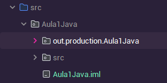
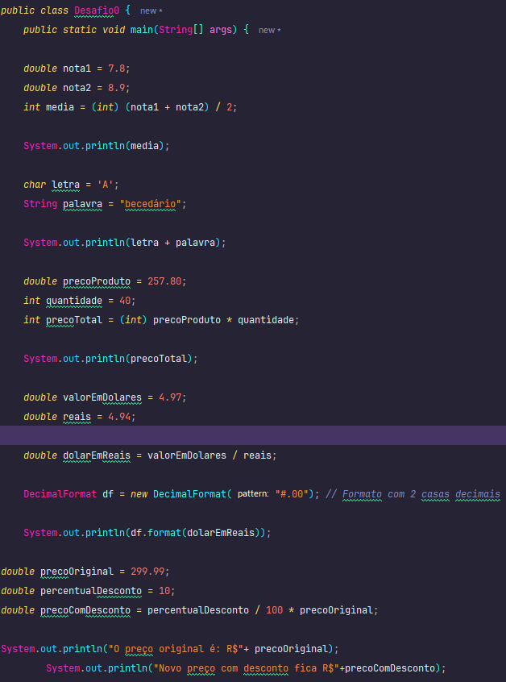
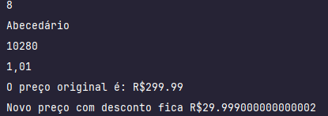
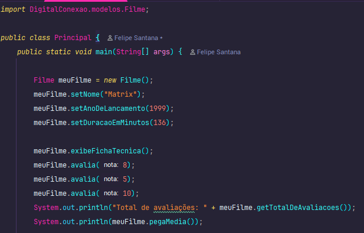
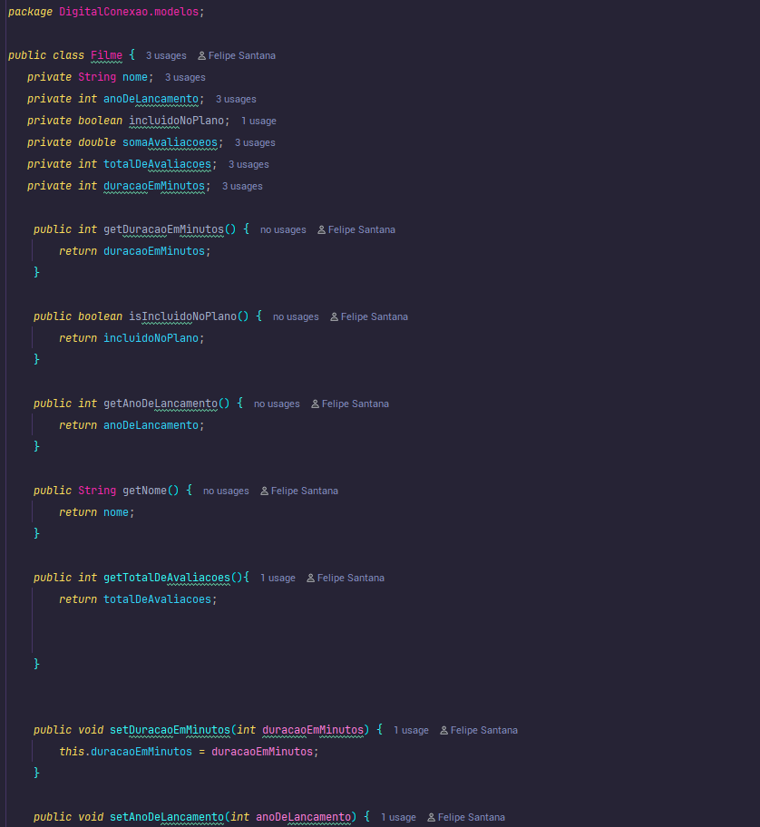
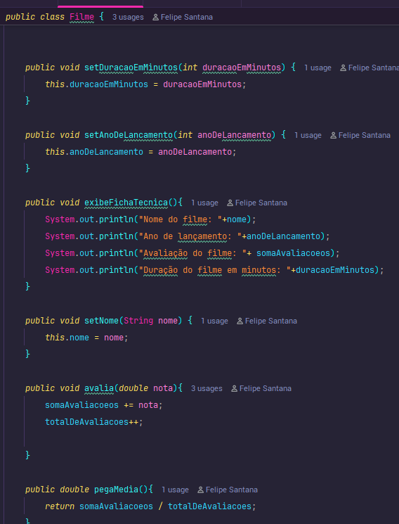
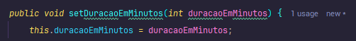
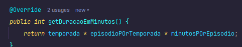
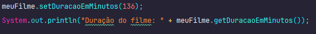
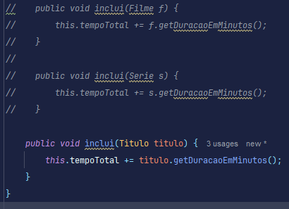

# Olá, me chamo Felipe!
### Esse Readme é para eu documentar tudo o que tô aprendnedo em Java dentro do programa ONE.

---

---

Dentro dessa pasta fica todo o meu estudo de lógica, como operadores aritméticos, condicionais, laços de repetição etc.
Segue um exemplo de um código e seu resultado abaixo 👇

---

Esses foram alguns dos exercícios de lógica que eu fiz que estão dentro dessa pasta.

---
##### Agora partindo para um estudo mais desafiador, tenho visto programação orientada a objetos.
Que consiste em uma série de mini conceitos dentro do próprio conceito de objeto. E nesse momento ainda estou aprendendo os conceitos.

Já tive contato com encapsulamento e vou e irei mostrar abaixo um exemplo do exercício que fiz com esse encapsulamento. 👇

---

---

---

# Aprendendo o conceito de herança, classe mãe/filha e sobreescrita(@override).

## Herança
Consiste em ter uma única classe com várias variaveis que outras classes tem em comum.

## Exemplo 
Tenho uma classe 'Titulo', uma 'Filme' e uma 'Serie', filmes e séries são títulos
e todo título tem avaliação, duração, ano em que foi lançado etc.

## Classe mãe/filha
No exemplo acima, a classe mãe sería a classe 'Titulo' e filhas seriam 'Filme' e 'Serie'

## Override
Indica um novo método para uma mesma variável, como deixei nos exemplos acima (imagens).

---

# Para não criar mais de um método, usei a super classe (classe mãe 'Titulo') para fazer um método que inclua todas as classes existentes dentro da super classe. O nome disso é Desgine de classe 

👇

---